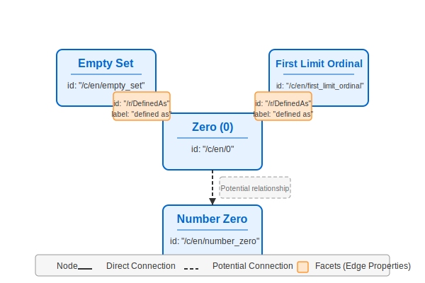
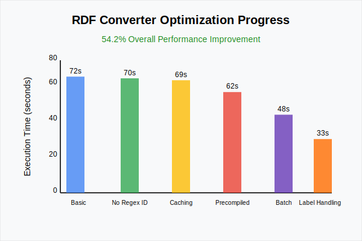
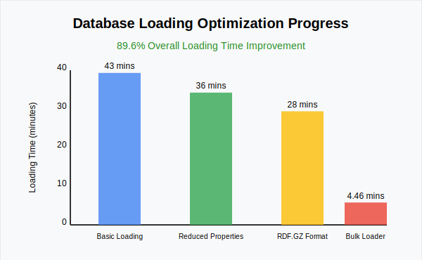

# Team 19: CSKG Database Implementation
## Authors: Shevchenko Denys & Karabanov Yehor

## 📚 Technology Stack
- **Dgraph** - Open source, AI-ready graph database with horizontal scaling and GraphQL support
  - Provides ACID transactions, consistent replication, and linearizable reads
  - Native GraphQL integration optimizes disk arrangement for query performance
  - Reduces disk seeks and network calls in clustered environments

- **Python** - High-level programming language for application development
- **Docker** - Container platform for consistent deployment environments
- **Bash** - Unix shell for automation and setup scripts

## 🔧 Prerequisites
- Docker Engine 24.0+

## 🚀 Quick Start

1. Clone the repository:
```bash 
git clone https://gitlab.kis.agh.edu.pl/databases-2-2025/19-shevchenko-denys-karabanov-yehor.git &&
cd 19-shevchenko-denys-karabanov-yehor
```
2. Start the database and load data, using -y flag will skip any dialogs:
```bash 
./dbcli.sh run
```
```bash 
./dbcli.sh run -y
```
3. Show all existing commands:
```bash
./dbcli.sh --help
```
4. Stop the database:
```bash    
./dbcli.sh stop
```
5. Clean up resources:
```bash
./dbcli.sh cleanup
```

## 🏗️ Architecture


### Components
1. **User Interface** - Command-line interface for interacting with the database
2. **Python CLI** - Application logic and database client implementation
3. **Dgraph Client** - gRPC communication layer between application and database
4. **Dgraph Database** - Underlying graph storage and query processing engine

## 📐 Database Design

### Dgraph Schema

```
id: string @unique @index(hash) .
label: string @index(term) .
to: [uid] @reverse @facet(id, label) .

type Node {
    id
    label
    to
}
```

### Schema Visualization


### Field Descriptions

| Field | Type | Constraints | Description |
|-------|------|-------------|-------------|
| `id` | `string` | `@unique @index(hash)` | Unique identifier for each node. The hash index enables fast lookups by ID. |
| `label` | `string` | `@index(term)` | Descriptive label for the node. Term indexing supports text search functionality. |
| `to` | `[uid]` | `@reverse` `@count` `@facet(id, label)` | Array of references to connected nodes. The `@reverse` directive enables bidirectional navigation between nodes. The `@count` property stores the amount of references connetected nodes. Each connection includes facets (edge properties) storing `id` and `label` metadata. |

### Edge Properties (Facets)

Each edge in the `to` field contains additional properties:

- **id**: Unique identifier for the edge relationship (e.g., ```"/r/DefinedAs"```)
- **label**: Descriptive label for the relationship (e.g., ```"defined as"```)

### Example Data (RDF Format)

```
# Node: Zero (0)
_:_c_en_0 <id> "/c/en/0" .
_:_c_en_0 <label> "0" .

# Node: Empty Set
_:_c_en_empty_set <id> "/c/en/empty_set" .
_:_c_en_empty_set <label> "empty set" .

# Edge: 0 defined as Empty Set (with facets)
_:_c_en_0 <to> _:_c_en_empty_set (id="/r/DefinedAs", label="defined as") .
```

### Data Example Visualization



### Key Design Decisions
- Directed graph structure with rich relationship metadata
- Bidirectional navigation via ```@reverse``` directive
- Strategic indexing for optimized query performance
- Facets to store additional edge properties

## 💻 Usage Examples

### Counting Predecessors or Successors
The system can count for all predecessors or successors of a given word.
```bash
./dbcli.sh count-predecessors /c/en/happy
```
```json
{
  "predecessors": [
    {
      "id": "/c/en/happy",
      "label": "123",
      "count": 8550
    }
  ]
}
```

### Finding Distant Synonyms or Antonyms
The system can find synonyms and antonyms that are multiple relationship hops away from a given word.

``` bash
./dbcli.sh find-distant-antonyms /c/en/math 2
```
```json
{
  "distant_antonyms": [
    {
      "id": "/c/en/impugnable",
      "label": "impugnable"
    },
    {
      "id": "/c/en/supposed",
      "label": "supposed"
    },
    {
      "id": "/c/en/suspicious",
      "label": "suspicious"
    },
    {
      "id": "/c/en/loose",
      "label": "loose"
    },
    {
      "id": "/c/en/alleged",
      "label": "alleged"
    },
    {
      "id": "/c/en/approximative",
      "label": "approximative"
    },
    {
      "id": "/c/en/hopeless",
      "label": "hopeless"
    }
  ]
}

```

### Searching for Simillar Nodes
System can find all simillar nodes, that share the same parent or child with the same edge id.
```bash
./dbcli.sh find-similar-nodes /c/en/0
```
```json
{
  "similar_nodes": [
    {
      "id": "/c/en/zero",
      "label": "zero",
      "shared_connections": [
        {
          "via_node": "/c/en/empty_set",
          "edge_type": "/r/DefinedAs"
        },
        {
          "via_node": "/c/en/set_containing_one_element",
          "edge_type": "/r/IsA"
        }
      ]
    },
    {
      "id": "/c/en/addy/n",
      "label": "addy",
      "shared_connections": [
        {
          "via_node": "/c/en/internet_slang",
          "edge_type": "/r/HasContext"
        }
      ]
    },
    {
      "id": "/c/en/afaic",
      "label": "afaic",
      "shared_connections": [
        {
          "via_node": "/c/en/internet_slang",
          "edge_type": "/r/HasContext"
        }
      ]
    },
    {
      "id": "/c/en/baww/v",
      "label": "baww",
      "shared_connections": [
        {
          "via_node": "/c/en/internet_slang",
          "edge_type": "/r/HasContext"
        }
      ]
    }
  ]
}
```

### Displaying Time Measurements
Add the `--verbose` or flag to any command to display detailed execution time measurements:
```bash
./dbcli.sh --verbose count-predecessors /c/en/happy 
```
```
`query output`
Query executed in 0.34 seconds
```


## 🔍 Query Examples


#### Find Nodes With Single Neighbor 
```
query nodesWithSingleNeighbor{
  var(func: has(id)) {
    successors_count as count(to)
    predecessors_count as count(~to)
    total_neighbors as math(successors_count + predecessors_count)
  }

  nodes_with_single_neighbor(func: has(id))
      @filter(eq(val(total_neighbors), 1))
      {
        amount:count(uid)
      }
}
```


#### Find Shortest Path Between Two Nodes
```
query shortestPath($id1: string, $id2: string) {
  A as var(func: eq(id, $id1))
  B as var(func: eq(id, $id2))

  shortestPath as shortest(from: uid(A), to: uid(B)) {
    to
    ~to
  }

  path(func: uid(shortestPath)) {
    id
    label
  }
}
```

#### Find Nodes With Most Neighbors
```
query nodesWithMostNeighbors($offset: string) {
  var(func: has(id)) {
    successors_count as count(to)
    predecessors_count as count(~to)
    total_neighbors as math(successors_count + predecessors_count)
  }
      
  nodes_with_most_neighbors(func: has(id), orderdesc: val(total_neighbors), first: 10, offset: $offset) {
    total_neighbors: val(total_neighbors)
    id
    label
  }
}
```

## 🔄 Implementation Process
1. Initial Research & Setup
   - Analysis of graph database options and selection of Dgraph
   - Docker environment configuration for consistent development
   - Basic project structure setup with Python and Bash scripts

2. Data Processing Pipeline
   - Development of data conversion scripts
   - Implementation of RDF format transformation
   - Optimization of bulk data loading process

3. Database Architecture
   - Graph schema design with node and edge properties
   - Index optimization for query performance
   - Implementation of bidirectional relationships

4. Query System Development
   - Core GraphQL± query implementation for all given tasks
   - Query optimization and testing

5. CLI Tools Creation
   - Development of dbcli.sh for database management
   - Implementation of Python CLI interface
   - Integration of health checks and retry mechanisms

6. Testing & Optimization
   - Query performance testing
   - Load testing and optimization

7. Documentation & Deployment
   - Project documentation and usage examples
   - Architecture diagrams
   - Deployment instructions

## 🧪 Testing

> **Note:** <br/>
> All testing was performed on the PC with the following specifications:
> - CPU: Intel Core i5-14400F
> - GPU: NVIDIA RTX 3060 12GB
> - RAM: 16GB DDR4 @ 3600MHz
> - SSD: Samsung 980 M.2 NVME 


### RDF Converter Optimization

The Python RDF converter underwent several optimization iterations, resulting in a 54.2% improvement in execution time from the initial implementation. Below is a breakdown of each optimization step and its impact:



| Optimization Step | Execution Time | Improvement | Description                                                                                                                                                          |
|-------------------|---------------|-------------|----------------------------------------------------------------------------------------------------------------------------------------------------------------------|
| Basic Implementation | 72 sec | Baseline    | Original implementation using standard Python libraries                                                                                                              |
| ID Sanitizer without Regex | 70 sec | 2.8%        | Replaced regex-based ID sanitization with direct string operations                                                                                                   |
| Escape String Caching | 69 sec | 4.1%        | Implemented caching mechanism for repeated string escape operations                                                                                                  |
| Precompiled Regex Patterns | 62 sec | 13.9%       | Used precompiled regex patterns for escape_string function                                                                                                           |
| Batch Processing Approach | 48 sec | 33.3%       | Redesigned batch processing algorithm for more efficient memory usage                                                                                                |
| Label Handling | 33 sec | 54.2%      | Fixed label with pipes handling , improved null label processing, dynamic batch sizing, reduced compression level, removed defaultdict usage and less function calls |


### Database Loading Optimization

We achieved dramatic improvements in database loading times through several optimization techniques:



| Optimization Step | Loading Time | Improvement | Description |
|-------------------|--------------|-------------|-------------|
| Basic Loading | 43 mins | Baseline    | Initial implementation using default settings and raw RDF files |
| Reduced Properties | 36 mins | 16.3%       | Eliminated redundant properties from the dataset |
| RDF.GZ Compression | 28 mins | 34.9%       | Used compressed RDF.GZ format instead of raw RDF |
| Dgraph Bulk Loader | 4.46 mins | 89.6%       | Switched from Dgraph Live Loader to Bulk Loader |

#### Loading Optimization Strategies

1. **Data Preprocessing**: Analyzing and removing redundant properties significantly reduced the data volume while preserving all necessary information. It was identified that storing node types of information is not necessary for current use case, as the data is already structured in a graph format. 

2. **Compression Benefits**: Using the .rdf.gz format  not only reduced storage requirements but also decreased I/O overhead during loading, leading to faster processing times.

3. **Bulk vs. Live Loading**: The most dramatic improvement came from switching from Dgraph's Live Loader to the Bulk Loader:
   - Live Loader: Processes data in a transactional manner, with built-in consistency checks
   - Bulk Loader: Bypasses transaction processing, generating and loading SSTable files directly
   
   While the Bulk Loader requires a database restart, the 89.6% total reduction in loading time justified this trade-off for initial data loading scenario.


## 👥 Team Contributions
**Shevchenko Denys**:
  - Infrastructure & DevOps:
    - Docker configuration and optimization
    - Shell script automation and dbcli.sh
  - Performance Testing & Optimization:
    - Bulk data import
    - Query execution optimization
    - Data conversion optimization 
  - Additional Queries (Tasks 16-18):
    - Distant synonyms/antonyms analysis
    - Pathfinding query

**Karabanov Yehor**:
  - Database Schema Architecture:
    - Graph data model design
    - Index optimization
    - Relationship structure
  - Python Applications:
    - CLI interface implementation
    - Data conversion utilities
    - Query system architecture
  - Core Query Development (Tasks 1-15):
    - Node counting operations
    - Relationship path analysis
    - Neighbor pattern detection

## ⭐ Self-evaluation
10/10 - Project meets all requirements and includes additional features beyond the basic specifications.

## 📄 License
MIT
