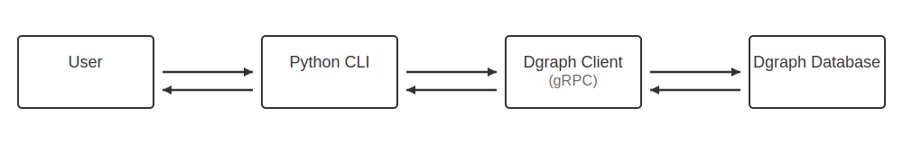
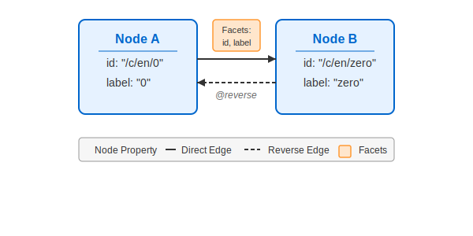

# Team 19: CSKG Database Implementation
## Authors: Shevchenko Denys & Karabanov Yehor

## 📚 Technology Stack
- **Dgraph** - Open source, AI-ready graph database with horizontal scaling and GraphQL support
  - Provides ACID transactions, consistent replication, and linearizable reads
  - Native GraphQL integration optimizes disk arrangement for query performance
  - Reduces disk seeks and network calls in clustered environments

- **Python** - High-level programming language for application development
- **Docker** - Container platform for consistent deployment environments
- **Bash** - Unix shell for automation and setup scripts

## 🔧 Prerequisites
- Docker Engine 24.0+

## 🚀 Quick Start
```bash
TO BE IMPLEMENTED
```

## 🏗️ Architecture



### Components
1. **User Interface** - Command-line interface for interacting with the database
2. **Python CLI** - Application logic and database client implementation
3. **Dgraph Client** - gRPC communication layer between application and database
4. **Dgraph Database** - Underlying graph storage and query processing engine

## 📐 Database Design

### Dgraph Schema

```graphql
id: string @unique @index(hash) .
label: string @index(term) .
to: [uid] @reverse @facet(id, label) .

type Node {
    id
    label
    to
}
```

### Schema Visualization


### Field Descriptions

| Field | Type | Constraints | Description |
|-------|------|-------------|-------------|
| `id` | `string` | `@unique @index(hash)` | Unique identifier for each node. The hash index enables fast lookups by ID. |
| `label` | `string` | `@index(term)` | Descriptive label for the node. Term indexing supports text search functionality. |
| `to` | `[uid]` | `@reverse @facet(id, label)` | Array of references to connected nodes. The `@reverse` directive enables bidirectional navigation between nodes. Each connection includes facets (edge properties) storing `id` and `label` metadata. |

### Edge Properties (Facets)

Each edge in the `to` field contains additional properties:

- **id**: Unique identifier for the edge relationship (e.g., ```"/r/DefinedAs"```)
- **label**: Descriptive label for the relationship (e.g., ```"defined as"```)

### Example Data (RDF Format)

```
# Node: Zero (0)
_:_c_en_0 <id> "/c/en/0" .
_:_c_en_0 <label> "0" .

# Node: Empty Set
_:_c_en_empty_set <id> "/c/en/empty_set" .
_:_c_en_empty_set <label> "empty set" .

# Edge: 0 defined as Empty Set (with facets)
_:_c_en_0 <to> _:_c_en_empty_set (id="/r/DefinedAs", label="defined as") .
```

### Data Example Visualization



### Key Design Decisions
- Directed graph structure with rich relationship metadata
- Bidirectional navigation via ```@reverse``` directive
- Strategic indexing for optimized query performance
- Facets to store additional edge properties

## 💻 Usage Examples

### Basic Node Renaming
```bash
TO BE IMPLEMENTED
```

### Searching for Node Relationships
```bash
TO BE IMPLEMENTED
```

### Sample Queries

#### Find Node by ID
```bash
TO BE IMPLEMENTED
```

#### Find Connected Nodes
```graphql
{
  nodes(func: eq(id, "/c/en/computer")) {
    id
    label
    to @facets {
      id
      label
    }
    ~to @facets {
      id
      label
    }
  }
}
```

## 🔄 Implementation Process
1. Data analysis to determine optimal technology selection
2. Database learning and requirement validation
3. Schema design and optimization for graph representation
4. Python converter development for data transformation
5. ...

## 🧪 Testing

### Performance Testing
- TO BE IMPLEMENTED

## 👥 Team Contributions
• **Shevchenko Denys**:
  - Docker configuration and containerization
  - Bulk data import functionality
  - Python converter optimization
  - Shell scripting for deployment

• **Karabanov Yehor**:
  - Database schema architecture
  - Python CLI implementation
  - Core database query development


## ⭐ Self-evaluation
10/10 - Project meets all requirements and includes additional features beyond the basic specifications.

## 📄 License
MIT
